# Minecraft PE 0.6.1 Windows Universal

[简体中文](README_zh-CN.md)

This project is a Windows-focused continuation of the leaked Minecraft Pocket Edition 0.6.1 source code. It modernizes and maintains the game for Windows x86, x64 and ARM64, while adding input, rendering, world-generation and user-interface improvements.

This project is intended for educational and preservation purposes only. Feel free to fork this project, but **DO NOT** use it for commercial purposes.

## Project status

| Target        | Status                                     | Build system  |
| ------------- | ------------------------------------------ | ------------- |
| Windows x86   | Supported                                  | Visual Studio |
| Windows x64   | Supported                                  | Visual Studio |
| Windows ARM64 | Supported                                  | Visual Studio |
| Windows ARM32 | Experimental; runs on selected WOA devices | Visual Studio |

The project is primarily developed and tested on Windows. Other platforms from the upstream projects are not official targets of this repository.

## Upstream projects and references

In March 2026, the source code of Minecraft Pocket Edition v0.6.1 was leaked on the Internet. You can find it at [Minecraft PE Source Code](https://archive.org/details/Minecraftpesorucecode). This is the reason why several revisions of MCPE0.6.1 appears on github and other sites. This project is also a revision of the origin code. All the revisions **DO NOT** have direct authorization from Mojang.

This project originated from [programmer1o1/MinecraftPE-v0.6.1](https://github.com/programmer1o1/MinecraftPE-v0.6.1), referred to below as **Project B**. Project B provides the main modernized source base and multi-platform porting work.

Some Java Beta visual ideas and related implementation details were studied from [minecraft-pe-0.6.1-on-all](https://github.com/Minecraft-PE-0-6-1/minecraft-pe-0.6.1-on-all), referred to below as **Project A**.

The Sky world and several visual behaviors were implemented with reference to Minecraft Java Edition Beta 1.7.3 source code using Mod Coder Pack 4.3: [mcp43](https://www.mediafire.com/file/03d94f13c9ulj5a/mcp43.zip). These references do not imply official affiliation or authorization by Mojang.

The main work of this project is assisted with the help of Codex.

## Features

### Original MCPE features

- Old finite-world generation
- Mobs, lighting, sky rendering and the Nether Reactor
- Touchscreen controls

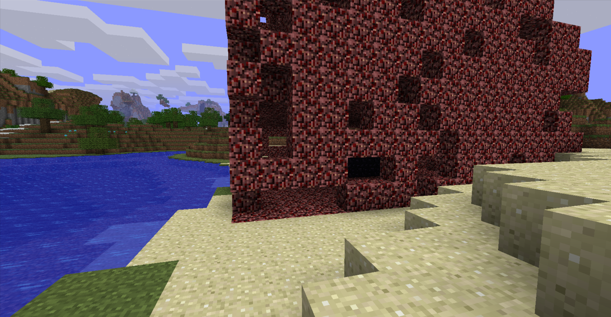

The terminated Nether Reactor Towel

### New gaming features

The features below can be experienced after opening the corresponding settings in "Options", "Additional". If you wish to have an experience close to original MCPE0.6.1, you can remain those settings off.

- More world type (Infinite and Sky)

- Java Edition Beta visual effects

- Skin settings and skin import support

- Touch sneak option

- F3 Debug Screen

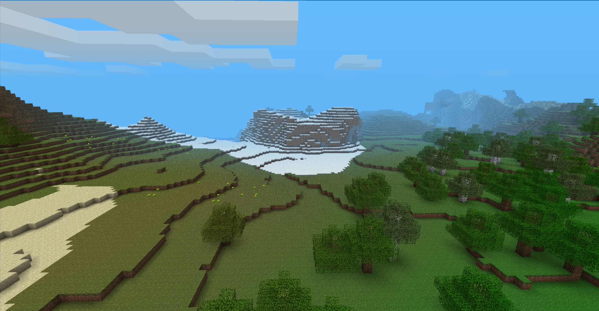

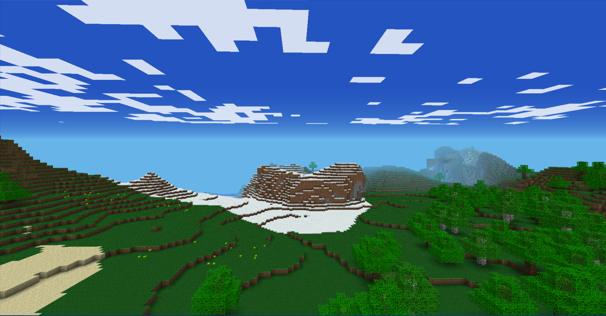

Difference view of original PE visual and Java Beta visual

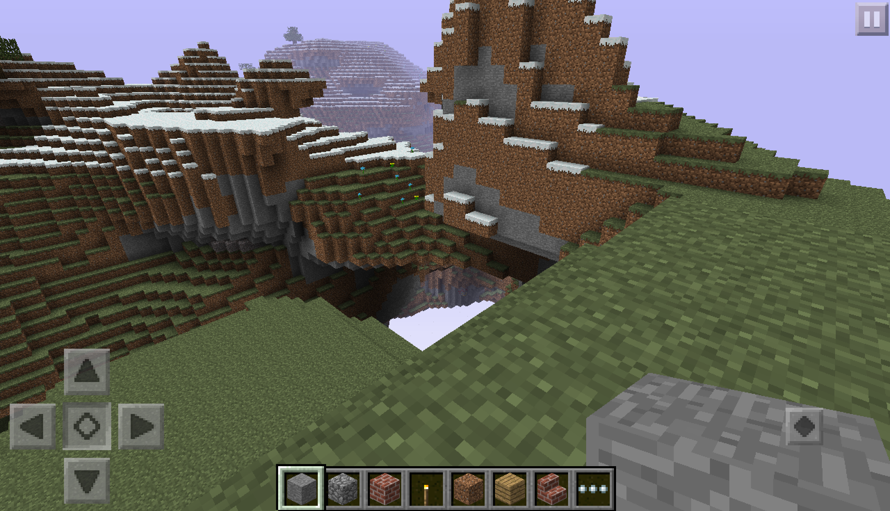

Ability to sneak under touch input

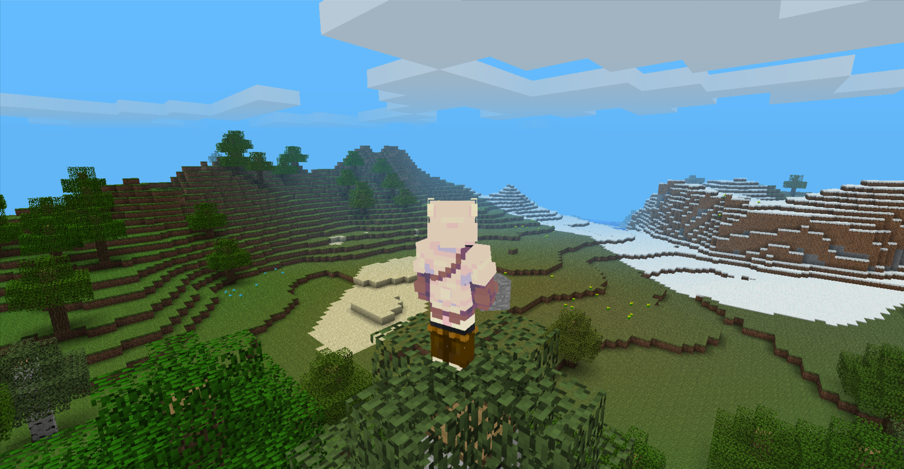

Optimized skin

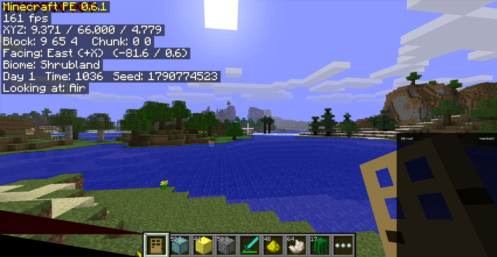

F3 Debug Screen

### Improvements

- Keyboard and mouse controls
- Windows x86, x64 and ARM64 builds
- Selectable touch or keyboard/mouse input mode
- Mouse capture and crosshair-centered mouse look
- Improved block breaking and placement behavior
- Screen button hover feedback
- Java Edition style button on keyboard mode
- Creative-mode running
- F1: hide or show the HUD
- F5: switch between first-person and third-person view
- Q: drop item
- Render distance and smooth-lighting options

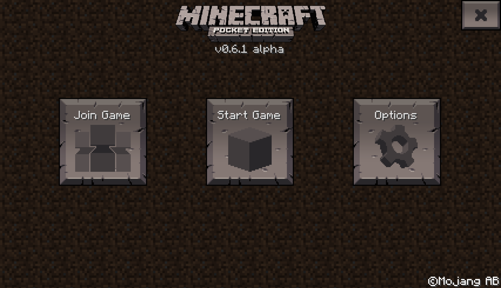

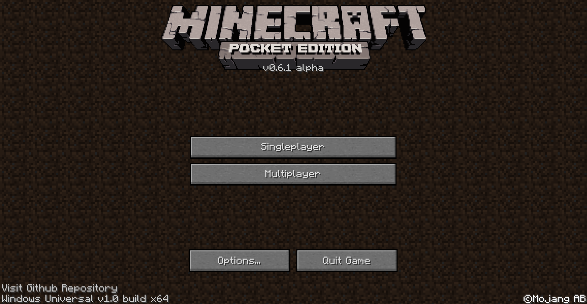

Different main page under different input mode

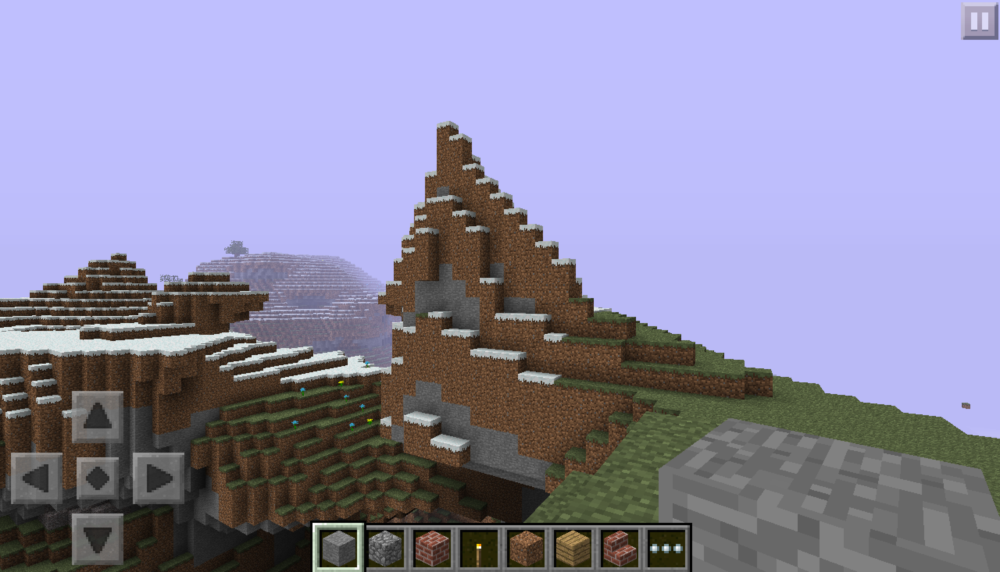

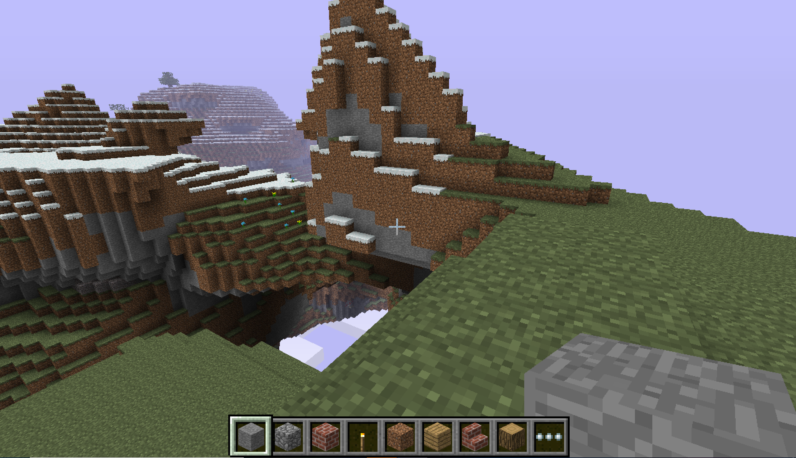

Different gaming screenshots under different input mode

### Interface and customization

- Welcome screen for choosing input mode and GUI scale
- Adjustable GUI and D-pad sizes

## World types

**IMPORTANT**: Infinite and Sky world have a level saving format different from both the original MCPE 0.6.1 and later MCPE infinite versions like 0.9. Therefore, these two types of world **CANNOT** be converted and opened in any versions of original MCPE at the moment. Future plans include Infinite/Sky world conversion tools for later MCPE versions.

### Old (finite) world

The origin world type that uses the same generator with origin MCPE0.6.1. Players can play in a world with a boundary of 256×256, and the outer space is filled with invisible bedrock. Note that due to the random number variation, the spawn point in creative mode and survival mode is different in origion MCPE0.6.1. This project inherit this feature.

### Infinite world

Infinite worlds use multi-region chunk storage and support exploration beyond the original 256×256 world boundary. The generator is adapted from the finite generator, which means you can find the exact same terrain of finite world in coordinate within finite world boundary in the same seed. The feature of different spawn point in survival/creative mode is also inherited.

### Sky world

Sky world is a floating-island world type based on the unused Sky dimension logic in Java Edition Beta 1.6 - 1.8. It uses a fixed Sky biome and separate terrain generation rules. Clouds are below the floating island. The sky color is light pruple (only when opening Java Beta Visual). Several changes have been made to ensure the playability in survival mode:

- 4 types of animals can all spawn instead of only chicken. Chicken still has a larger spawning rate comparing to other three types of animal.

- Day-night circle is kept in survival mode.

- The lowest block of floating island is around Y = 18, so in Java Edition diamond cannot spawn in Sky. In here, ores now generate in height range that blocks generate, so diamond can be found.

- To balance the difficulty, mob only spawns when light is low enough and there is at least one block above in Y axis, which means mobs do not spawn at night in open area.
  
  

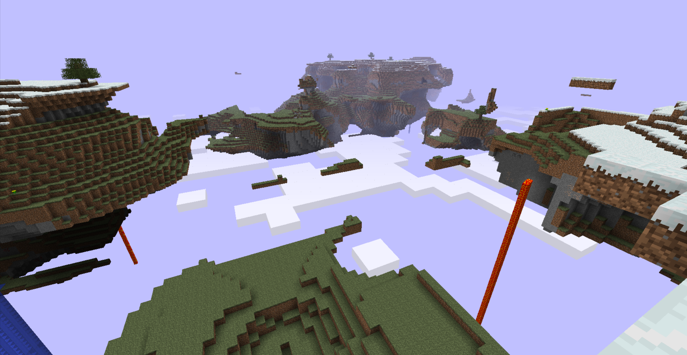

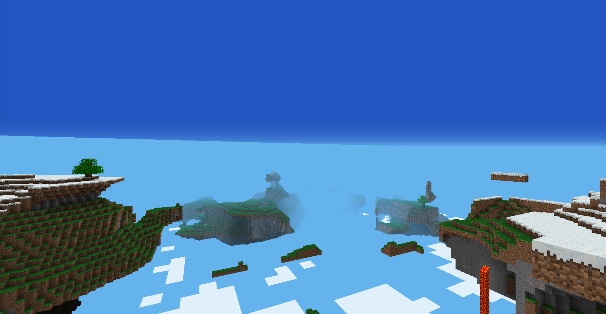

Difference view of Sky world under PE and Java Beta visual

## Improvements and bug fixes

### Fixes inherited from Project B

- Fixed infinite-world coordinate and spawn handling inherited from the original finite-world assumptions.
- Added multi-region storage for infinite worlds.
- Fixed missing chunk-boundary faces after neighboring chunks are loaded.

### Project specific fixes

* Fixed the issue of no sound.
* Transform Graphic API from PowerVR OpenGL ES emulation to Native WGL-based desktop OpenGL rendering.
* Original input textbox, bringing back the function of input world name, seed and player name
* Fixed player cannot eat food in keyboard mode.
* Fixed crashes when loading existing Infinite worlds with Java Beta visuals enabled.
* Fixed random snow and tree features being lost after saving and reloading worlds.
* Fixed mob and spawning issues encountered in infinite and Sky worlds.
* Fixed spawn-position issues in Sky worlds to avoid spawn on void and tiny islands.
* Improved keyboard/mouse interaction and block targeting.
* Added F1/F5 shortcuts and F3 debugging support.
* Corrected the sun's movement direction to match the F3 compass and Java Beta behavior.
* Added biome-dependent grass and oak/birch leaf colors for Java Beta visuals.
* Fixed Nether Reactor may crash the game when running.
* Fixed Nether Reactor lead to no response in Infinite and Sky world.

## Building

Open the corresponding Visual Studio solution:

| Target        | Solution                                       |
| ------------- | ---------------------------------------------- |
| Windows x86   | `handheld/project/x86/MinecraftWin32.sln`      |
| Windows x64   | `handheld/project/x64/MinecraftWin64.sln`      |
| Windows ARM64 | `handheld/project/arm64/MinecraftWinARM64.sln` |
| Windows ARM32 | `handheld/project/arm/MinecraftWinARM.sln`     |

Select the desired architecture and configuration in Visual Studio. Release builds are recommended for normal performance testing. Debug builds are intended for debugging and may run substantially slower.

The required native libraries and runtime files are available in the project’s platform-specific library and game directories. The exact dependency layout is kept with the Visual Studio projects. After compiling the game, you need to copy `MCPE0.6.1Universal\handheld\data` and 4 dependencies in different architecture folders inside `MCPE0.6.1Universal\handheld\lib\bin` to run the game.

Currently, the ARM32 build is able to launch and run on my Windows on ARM device. As WOA do not support VBO for WGL on ARM32, the ARM32 game can only render with OpenGL 1.1, and even with the lowest graphics settings, it only achieves around 10 FPS. Due to these severe performance and rendering issues, ARM32 binaries will not be included in GitHub Releases for now, although the source code and build configuration will remain available.

I do not own a Windows RT device, so compatibility with devices such as the Surface RT remains untested. If you own a jailbroken Windows RT device and are interested in testing this project, you are welcome to compile the ARM32 version and report any compatibility issues, performance results or rendering errors through GitHub Issues.

A Direct3D 9 rendering backend may be considered in the future, but further ARM32 development is not currently a priority.

## Keyboard Controls

| Key / Action | Function                    |
| ------------ | --------------------------- |
| W A S D      | Move                        |
| Space        | Jump                        |
| Left Shift   | Sneak                       |
| Left click   | Mine / Attack               |
| Right click  | Place block / Interact      |
| 1 - 9        | Select hotbar slot          |
| Scroll wheel | Scroll hotbar               |
| E            | Open inventory              |
| Ctrl         | Toggle run (Creative)       |
| F            | Toggle Spectator (Creative) |
| Q            | Drop item                   |
| R            | Crafting (Survival)         |
| F1           | Toggle hide HUD             |
| F3           | Toggle Debug Screen         |
| F5           | Toggle third-person view    |
| Escape       | Pause / back                |

## Known limitations

- Vibrate on Destroy is not implemented on Windows.
- Skin changes may require restarting the game.
- ARM32 remains experimental and have performance and rendering compatibility issues.
- Some options and resource paths are specific to the Windows Universal port.

## Future plans

- UWP support
- Chinese localization
- Further improvements to incremental chunk saving and unloading
- Infinite/Sky world conversion tools for later MCPE versions
- Possible D3D9 rendering backend migration for ARM32; this is not a current priority

## Attribution

This repository is an independent continuation based on leaked Minecraft Pocket Edition 0.6.1 source code and related community projects. Please retain the upstream references when redistributing source code or derivative work.

The project is not affiliated with or endorsed by Mojang Studios or Microsoft.
