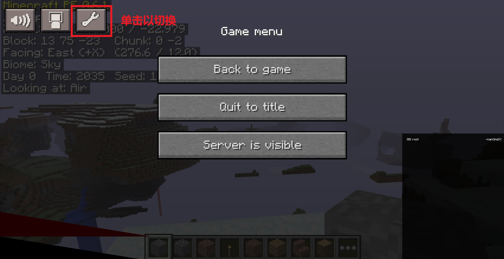

<h1 align="center">Minecraft PE 0.6.1 Windows Universal</h1>

<a href="README.md">English</a>

本项目是基于泄露的 Minecraft Pocket Edition 0.6.1 源代码开发的、以 Windows 为主要目标平台的延续项目。项目对游戏进行了现代化维护，使其支持 Windows x86、x64 和 ARM64，同时加入了输入、渲染、世界生成和用户界面等方面的改进。

本项目仅用于教育和软件保存目的。欢迎 Fork 本项目，但请勿将其用于商业用途。

---

<h2 align="center">维护状态</h2>

| 目标平台          | 状态                   | 构建系统          |
| ------------- | -------------------- | ------------- |
| Windows x86   | 支持                   | Visual Studio |
| Windows x64   | 支持                   | Visual Studio |
| Windows ARM64 | 支持                   | Visual Studio |
| Windows ARM32 | 实验性支持；可在部分 WOA 设备上运行 | Visual Studio |

本项目主要面向 Windows 进行开发和测试。上游项目支持的其他平台并非本仓库的正式目标平台。

---

<h2 align="center">引用与参考</h2>

2026 年 3 月，Minecraft Pocket Edition v0.6.1 的源代码在互联网上泄露，其可以在 [Minecraft PE Source Code](https://archive.org/details/Minecraftpesorucecode) 找到。这也是 GitHub 等网站上出现多个 MCPE 0.6.1 修改版本的原因。本项目同样是基于原始代码开发的修改版本。所有这些修改版本均**未获得 Mojang 的直接授权**。

本项目源自 [programmer1o1/MinecraftPE-v0.6.1](https://github.com/programmer1o1/MinecraftPE-v0.6.1)，下文称为 **Project B**。Project B 提供了主要的现代化源码基础以及多平台移植工作。

部分 Java Beta 视觉效果的思路和相关实现参考了 [minecraft-pe-0.6.1-on-all](https://github.com/Minecraft-PE-0-6-1/minecraft-pe-0.6.1-on-all)，下文称为 **Project A**。

天域世界以及部分视觉效果参考了 Minecraft Java Edition Beta 1.7.3 的源代码，并使用 Mod Coder Pack 4.3：[mcp43](https://www.mediafire.com/file/03d94f13c9ulj5a/mcp43.zip)。上述这些参考并不代表本项目与 Mojang 存在任何官方关联或获得其授权。

本项目的主要开发工作在 Codex 的协助下完成。

---

<h2 align="center">功能</h2>

### 原版 MCPE 功能

* 原版有限世界生成

* 生物、光照、天空渲染以及下界反应堆

* 触摸屏操作

运行结束后的下界反应堆塔

### 新增游戏功能

以下功能可以在“Options（选项）”中的“Additional（附加设置）”开启。如果希望获得接近原版 MCPE 0.6.1 的游戏体验，可以保持这些选项关闭。

* 更多世界类型（Infinite 无限世界和 Sky 天域世界）

* Java Edition Beta 风格视觉效果

* 皮肤设置和皮肤导入支持

* 触摸屏潜行选项

* F3 调试界面

原版 PE 视觉效果与 Java Beta 视觉效果对比

触摸输入模式下的潜行功能

自定义皮肤

F3 调试界面

### 改进

* 键盘和鼠标操作

* Windows x86、x64 和 ARM64 架构的原生支持

* 可选择触摸或键盘/鼠标输入模式

* 鼠标隐藏并固定在准星为中心的视角控制

* 改进方块破坏和放置行为

* 屏幕按钮鼠标/手指悬停反馈

* 键鼠模式下采用 Java 版风格按钮

* 创造模式下的疾跑

* F1：隐藏或显示 HUD

* F5：切换第一人称/第三人称视角

* Q：丢弃物品

* 可调整渲染距离和平滑光照

不同输入模式下的主界面

不同输入模式下的游戏画面

### 界面与自定义

* 欢迎界面，可选择输入模式和 GUI 缩放

* 可调整 GUI 和方向键大小

---

<h2 align="center">世界类型</h2>

**重要提醒：** Infinite（无限）和 Sky（天域）世界采用的存档格式既不同于原版 MCPE 0.6.1，也不同于 MCPE 0.9 等后续版本的无限世界。因此，目前这两种世界**无法**转换并在任何原版 MCPE 中打开。未来计划开发将 Infinite/Sky 世界转换至后续 MCPE 版本的工具。

### Old（有限）世界

原版世界类型，使用与原版 MCPE 0.6.1 相同的生成机制。玩家可以在边界为 256×256 的世界中游玩，世界外围由隐形基岩包围。

需要注意的是，由于随机数的差异，原版 MCPE 0.6.1 中创造模式和生存模式的出生点并不相同。本项目保留了这一特性。

### Infinite（无限）世界

无限世界采用多 Region 区块存储，可以探索原版 256×256 世界边界之外的区域。

其生成器由有限世界生成器改造而来，因此在使用相同种子的情况下，在有限世界边界范围内可以生成与有限世界完全相同的地形。生存模式与创造模式出生点不同的特性同样得到保留。

### Sky（天域）世界

天域世界是一种浮空岛世界类型，基于 Minecraft Java 版 Beta 1.6 到 1.8 中未实装的 Sky Dimension 逻辑实现。它使用固定的 Sky 生物群系以及独立的地形生成规则。云层位于浮岛下方。启用 Java Beta Visual 后，天空呈浅紫色。

为了确保生存模式下的可玩性，本项目进行了以下调整：

* 四种动物均可生成，而非只有鸡可以生成。鸡相较其他三种动物仍拥有更高的生成概率。

* 生存模式中保留昼夜循环。

* 浮岛最低的方块大约位于 Y = 18，因此在 Java 版原始 Sky 世界中钻石无法生成。本项目调整了矿石生成高度，使矿石可以在实际存在方块的高度范围内生成，故可以找到钻石。

* 为平衡难度，敌对生物只有在光照足够低，并且 Y 轴上方至少存在一个方块时才会生成。这意味着夜间的露天区域不会生成敌对生物。

天域在 Java Beta 与PE视觉效果下的对比

---

<h2 align="center">改进与 Bug 修复</h2>

### 继承自 Project B 的修复

* 修复由原版有限世界逻辑遗留导致的无限世界坐标和出生点处理问题。

* 为无限世界加入多 Region 存储。

* 修复相邻区块加载后区块边界表面缺失的问题。

### 本项目的修复

* 修复无声音的问题。

* 将图形 API 从 PowerVR OpenGL ES 模拟层迁移至基于 WGL 的原生桌面 OpenGL 渲染。

* 恢复原始文本输入框，使世界名称、种子和玩家名称可以正常输入。

* 修复键鼠模式下玩家无法进食的问题。

* 修复开启 Java Beta 视觉效果后加载已有无限世界时可能发生的崩溃。

* 修复保存并重新加载世界后随机区域的雪和树木可能丢失的问题。

* 修复无限世界和 Sky 世界中的生物及生成相关问题。

* 修复 Sky 世界出生位置问题，避免玩家出生在虚空或过小的岛屿上。

* 改进键盘/鼠标交互以及方块目标判定。

* 添加 F1/F5 快捷键以及 F3 调试功能。

* 修正太阳移动方向，使其与 F3 显示的方向以及 Java Beta 的行为一致。

* 为 Java Beta 视觉效果加入根据生物群系变化的草地以及橡树/白桦树叶颜色。

* 修复运行下界反应器时可能导致游戏崩溃的问题。

* 修复下界反应器在 Infinite 和 Sky 世界中导致游戏无响应的问题。

---

<h2 align="center">构建</h2>

打开目标架构对应的 Visual Studio 解决方案：

| 目标平台          | Solution                                       |
| ------------- | ---------------------------------------------- |
| Windows x86   | `handheld/project/x86/MinecraftWin32.sln`      |
| Windows x64   | `handheld/project/x64/MinecraftWin64.sln`      |
| Windows ARM64 | `handheld/project/arm64/MinecraftWinARM64.sln` |
| Windows ARM32 | `handheld/project/arm/MinecraftWinARM.sln`     |

在 Visual Studio 中选择所需的架构和配置。正常性能测试建议使用 Release 构建。Debug 构建主要用于调试，其运行速度明显更慢。

项目所需的原生库和运行时文件位于对应平台的库和游戏目录中，具体依赖目录结构与 Visual Studio 工程一同保留。编译游戏后，需要复制 `MCPE0.6.1Universal\handheld\data`，以及 `MCPE0.6.1Universal\handheld\lib\bin` 中对应架构文件夹内的 4 个依赖文件，之后即可运行游戏。

目前 ARM32 版本可以在我的 Windows on ARM 设备上启动并运行。由于该 WOA 环境下 ARM32 的 WGL 不支持 VBO，ARM32 游戏只能使用 OpenGL 1.1 进行渲染。即使使用最低画质设置，游戏也只能达到可怜的约 10 FPS。由于诸如此类的严重性能/渲染问题，目前 GitHub Releases 不会提供 ARM32 二进制文件，但源码和构建配置仍会保留。

我没有 Windows RT 设备，因此尚未测试 Surface RT 等设备的兼容性。如果你拥有已经越狱的 Windows RT 设备，并且有兴趣测试本项目，欢迎自行编译 ARM32 版本，并通过 GitHub Issues 反馈兼容性问题、性能测试结果或渲染错误。

未来可能会考虑加入 Direct3D 9 渲染后端，但进一步开发 ARM32 目前并非项目的优先事项。

---

<h2 align="center">键盘操作</h2>

| 按键 / 操作    | 功能           |
| ---------- | ------------ |
| W A S D    | 移动           |
| Space      | 跳跃           |
| Left Shift | 潜行           |
| 鼠标左键       | 挖掘 / 攻击      |
| 鼠标右键       | 放置方块 / 交互    |
| 1 - 9      | 选择快捷栏槽位      |
| 鼠标滚轮       | 滚动快捷栏        |
| E          | 打开物品栏        |
| Ctrl       | 切换奔跑状态（仅限创造） |
| F          | 切换旁观模式（仅限创造） |
| Q          | 丢弃物品         |
| R          | 合成界面（仅限生存）   |
| F1         | 切换 HUD 显示/隐藏 |
| F3         | 切换调试界面       |
| F5         | 切换第三人称视角     |
| Escape     | 暂停 / 返回      |

---

<h2 align="center">已知限制</h2>

* Windows 上尚未实现“Vibrate on Destroy（破坏时振动）”。

* 更换皮肤后可能需要重新启动游戏以应用。

* ARM32 仍处于实验阶段，存在性能和渲染兼容性问题。

* 部分选项和资源路径为 Windows Universal 移植版特有。

---

<h2 align="center">未来计划</h2>

* UWP 支持

* 中文支持

* 进一步改进增量区块保存和卸载

* 为后续 MCPE 版本开发 Infinite/Sky 世界转换工具

* （待定）将 ARM32 的渲染后端迁移至 D3D9；目前并非开发重点

---

<h2 align="center">署名与声明</h2>

本仓库是基于泄露的 Minecraft Pocket Edition 0.6.1 源代码以及相关社区项目开发的独立延续项目。重新分发源代码或衍生项目时，请保留对上游项目的引用。

本项目与 Mojang Studios 或 Microsoft 无任何隶属关系。
